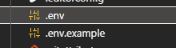
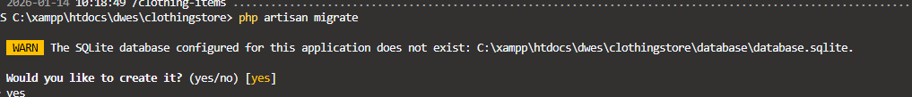

# Clothing Store

v1. Versión sólo con el CRUD


## Clonar un Proyecto Laravel de un repositorio de Github

```
git clone https://github.com/pamariniesfranciscodelosrios/clothingstore.git
```

**2º Instalar dependencias**

```
composer install
```

Instala la carpeta VENDOR

**3º copiar y pegar** .env.example  para convertirlo en **.env**



Esto es solo porque usamos SQLite si no, habría que configurar con nuestro Mysql

**4º Generar la clave** para mi proyecto


```
php artisan key:generate
```


**5º Migrar y crear el archivo de base de datos**

```
php artisan migrate
```



```


php artisan serve
```
