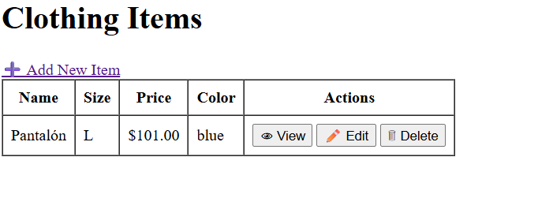

# Clothing Store

v1. Versión sólo con el CRUD



## Clonar un repositorio de Github

```
git clone https://github.com/pamariniesfranciscodelosrios/clothingstore.git
```

**2º Instalar dependencias**

```
composer install
```

Instala la carpeta VENDOR


**3º copiar y pegar** .env.example  para convertirlo en **.env**

**4º Generar la clave** para mi proyecto

```
php artisan key:generate
```
